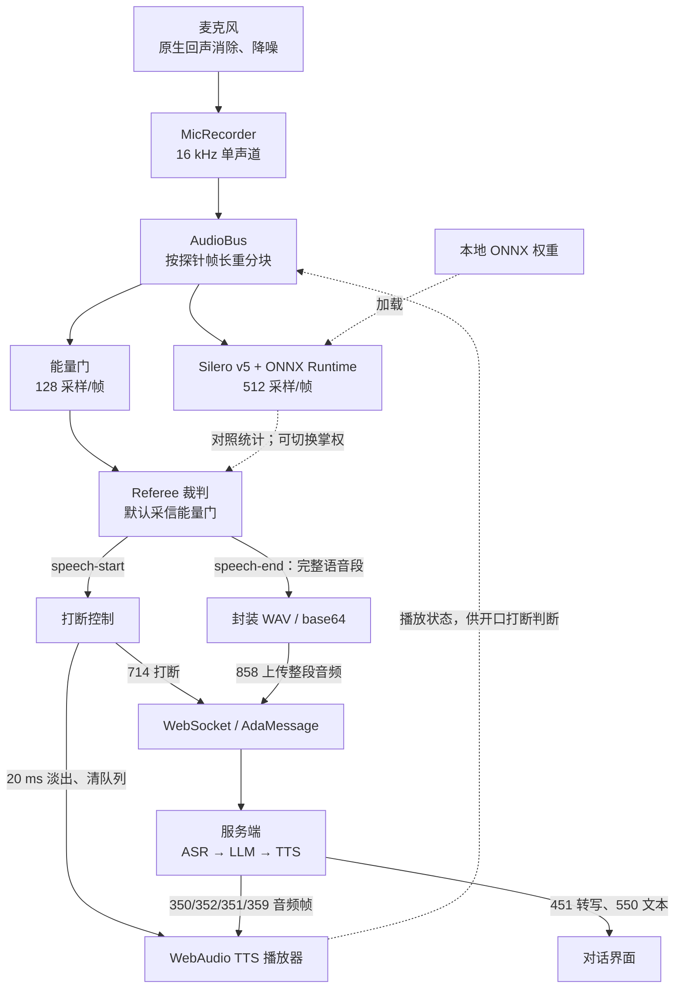

```mermaid
flowchart TB
    Mic["麦克风<br/>原生回声消除、降噪"] --> Recorder["MicRecorder<br/>16 kHz 单声道"]
    Recorder --> Bus["AudioBus<br/>按探针帧长重分块"]

    Bus --> Energy["能量门<br/>128 采样/帧"]
    Bus --> Silero["Silero v5 + ONNX Runtime<br/>512 采样/帧"]
    Model["本地 ONNX 权重"] -.加载.-> Silero

    Energy --> Referee["Referee 裁判<br/>默认采信能量门"]
    Silero -.对照统计；可切换掌权.-> Referee

    Referee -->|"speech-start"| Interrupt["打断控制"]
    Referee -->|"speech-end：完整语音段"| Wav["封装 WAV / base64"]
    Interrupt -->|"20 ms 淡出、清队列"| Player["WebAudio TTS 播放器"]
    Interrupt -->|"714 打断"| WS["WebSocket / AdaMessage"]
    Wav -->|"858 上传整段音频"| WS

    WS --> Server["服务端<br/>ASR → LLM → TTS"]
    Server -->|"451 转写、550 文本"| UI["对话界面"]
    Server -->|"350/352/351/359 音频帧"| Player
    Player -.播放状态，供开口打断判断.-> Bus
```
## 关联

- 支持：

## 来源

- 